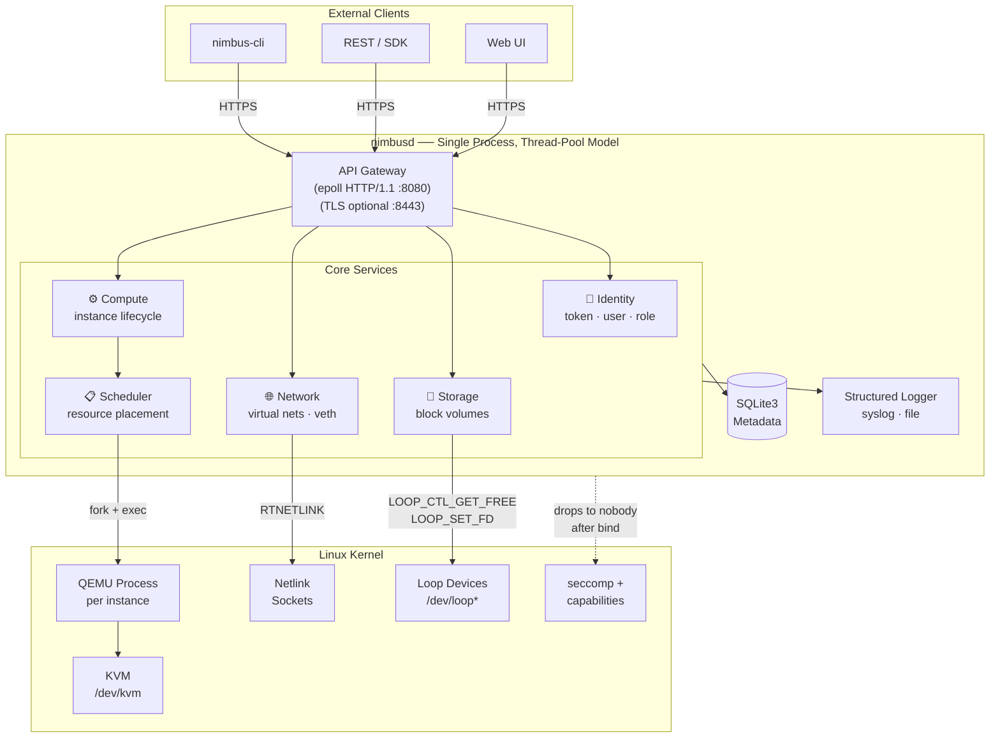
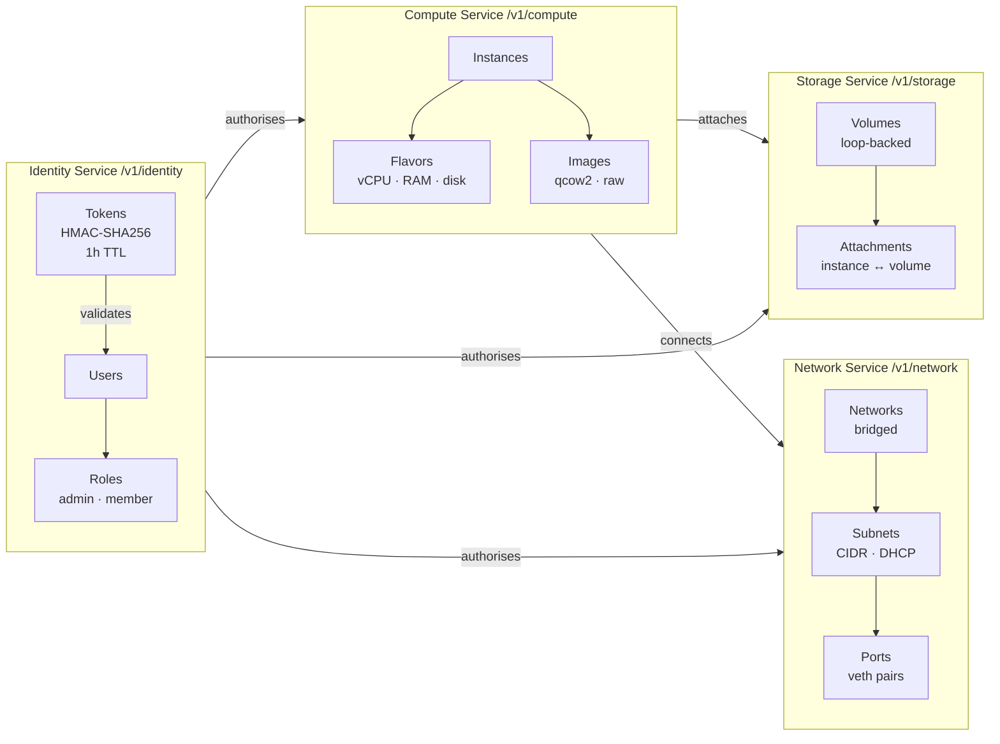
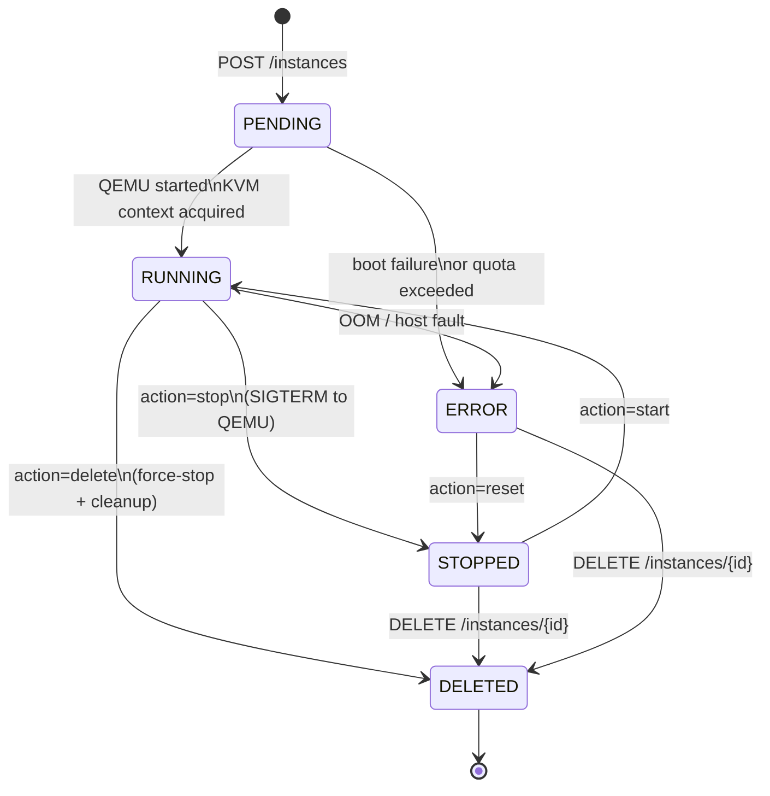
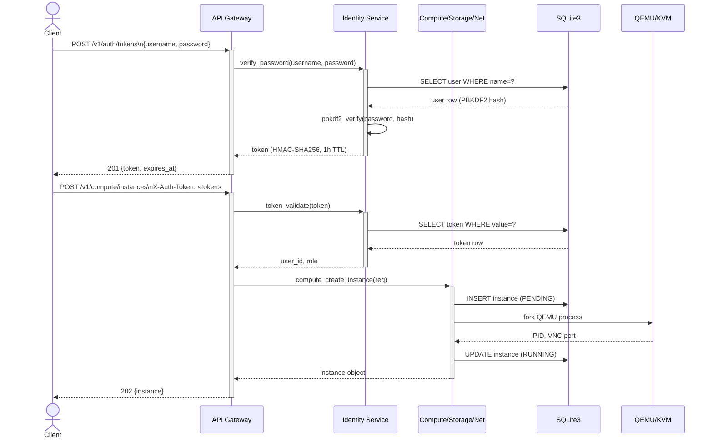
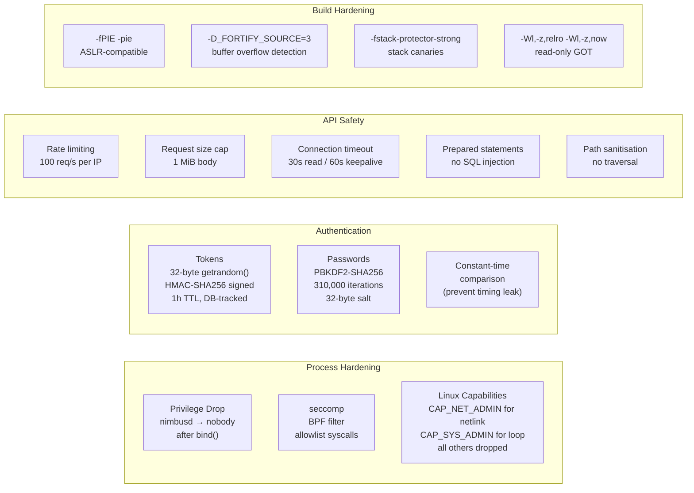

(This all is created by AI , nothing in production , even the name is not final.)
Please donot use in production.
# Cloud System — Self-Hosted Cloud Infrastructure Daemon

```

   ____   _       U  ___ u   _   _   ____         ____      __   __ ____     _____  U _____ u  __  __   
U /"___| |"|       \/"_ \/U |"|u| | |  _"\       / __"| u   \ \ / // __"| u |_ " _| \| ___"|/U|' \/ '|u 
\| | u U | | u     | | | | \| |\| |/| | | |     <\___ \/     \ V /<\___ \/    | |    |  _|"  \| |\/| |/ 
 | |/__ \| |/__.-,_| |_| |  | |_| |U| |_| |\     u___) |    U_|"|_uu___) |   /| |\   | |___   | |  | |  
  \____| |_____|\_)-\___/  <<\___/  |____/ u     |____/>>     |_|  |____/>> u |_|U   |_____|  |_|  |_|  
 _// \\  //  \\      \\   (__) )(    |||_         )(  (__).-,//|(_  )(  (__)_// \\_  <<   >> <<,-,,-.   
(__)(__)(_")("_)    (__)      (__)  (__)_)       (__)      \_) (__)(__)    (__) (__)(__) (__) (./  \.)  
 
  A lightweight, self-hosted cloud platform in pure C.
  Think OpenStack minus the footprint.
```

> **Cloud System** is a production-grade cloud infrastructure daemon written in pure C (C11).  
> It provides compute, block storage, virtual networking, and identity services through a  
> REST API — like a minimal AWS/Azure you run on your own hardware.

---

## Table of Contents

- [Architecture](#architecture)
- [Services](#services)
- [VM Lifecycle](#vm-lifecycle)
- [API Request Flow](#api-request-flow)
- [Prerequisites](#prerequisites)
- [Building](#building)
- [Configuration](#configuration)
- [Running](#running)
- [REST API Reference](#rest-api-reference)
- [Security Design](#security-design)
- [Resource Footprint](#resource-footprint)

---

## Architecture



---

## Services



---

## VM Lifecycle



---

## API Request Flow



---

## Prerequisites

### Runtime

| Dependency | Minimum Version | Purpose |
|---|---|---|
| Linux kernel | 5.4+ | KVM, netlink, loop devices, seccomp |
| KVM module | loaded | Hardware virtualisation |
| QEMU | 6.0+ | VM emulation / hypervisor |
| SQLite3 (runtime) | 3.35+ | Metadata store |

### Build

| Tool / Library | Package (Debian/Ubuntu) | Package (RHEL/Fedora) |
|---|---|---|
| GCC ≥ 11 or Clang ≥ 13 | `build-essential` | `gcc` |
| Meson ≥ 1.0 | `meson` | `meson` |
| Ninja | `ninja-build` | `ninja-build` |
| SQLite3 headers | `libsqlite3-dev` | `sqlite-devel` |
| Linux kernel headers | `linux-headers-$(uname -r)` | `kernel-devel` |
| pkg-config | `pkg-config` | `pkgconf` |

**Optional (for TLS termination at the daemon):**

| Library | Package (Debian) |
|---|---|
| mbedTLS ≥ 3.4 | `libmbedtls-dev` |

> **Tip:** For production, terminate TLS with nginx or HAProxy in front of nimbusd on port 8080. This is the recommended pattern.

### Verify KVM is available

```bash
ls /dev/kvm && echo "KVM OK" || echo "KVM MISSING — load module: modprobe kvm_intel (or kvm_amd)"
```

---

## Building

```bash
# Clone
git clone https://github.com/yourorg/nimbusd.git
cd nimbusd

# Configure (debug)
meson setup build --buildtype=debug

# Configure (release — hardened)
meson setup build \
  --buildtype=release       \
  -Db_pie=true              \
  -Db_lto=true              \
  -Dtls=disabled            \
  --prefix=/usr

# Build
ninja -C build

# Run tests
ninja -C build test

# Install (as root)
sudo ninja -C build install
```

### Build options

| Option | Default | Description |
|---|---|---|
| `tls` | `disabled` | Enable built-in mbedTLS support |
| `kvm` | `enabled` | Enable KVM/QEMU compute backend |
| `debug_sql` | `false` | Log all SQL statements |
| `max_connections` | `1024` | Max simultaneous API connections |

---

## Configuration

Copy the example config and edit:

```bash
sudo mkdir -p /etc/nimbusd
sudo cp nimbusd.conf.example /etc/nimbusd/nimbusd.conf
sudo $EDITOR /etc/nimbusd/nimbusd.conf
```

Key sections:

```ini
[daemon]
user  = nimbusd          ; drop privileges to this user after bind
group = nimbusd
pid_file = /run/nimbusd/nimbusd.pid

[api]
bind_address = 0.0.0.0
port         = 8080
; tls_port   = 8443      ; only if built with -Dtls=enabled
; tls_cert   = /etc/nimbusd/tls/cert.pem
; tls_key    = /etc/nimbusd/tls/key.pem
thread_pool_size = 16
request_timeout  = 30    ; seconds

[database]
path = /var/lib/nimbusd/nimbusd.db

[storage]
volume_dir = /var/lib/nimbusd/volumes
max_volume_gib = 1024

[compute]
qemu_binary  = /usr/bin/qemu-system-x86_64
image_dir    = /var/lib/nimbusd/images
vnc_base_port = 5900

[logging]
level    = info           ; debug | info | warn | error
file     = /var/log/nimbusd/nimbusd.log
syslog   = true
```

---

## Running

### Systemd (recommended)

```bash
# Create service user
sudo useradd --system --no-create-home --shell /sbin/nologin nimbusd
sudo usermod -aG kvm nimbusd

# Create directories
sudo mkdir -p /var/lib/nimbusd/{volumes,images} /var/log/nimbusd /run/nimbusd
sudo chown -R nimbusd:nimbusd /var/lib/nimbusd /var/log/nimbusd /run/nimbusd

# Enable + start
sudo systemctl daemon-reload
sudo systemctl enable --now nimbusd
sudo systemctl status nimbusd
```

### Manual

```bash
nimbusd --config /etc/nimbusd/nimbusd.conf --foreground
```

### First-time setup (create admin user)

```bash
nimbusd-admin user create --username admin --role admin --password "$(openssl rand -base64 24)"
```

---

## REST API Reference

All endpoints require `X-Auth-Token` header except `POST /v1/auth/tokens`.

### Identity

| Method | Path | Description |
|---|---|---|
| `POST` | `/v1/auth/tokens` | Obtain a token |
| `DELETE` | `/v1/auth/tokens/{token}` | Revoke a token |
| `GET` | `/v1/identity/users` | List users (admin) |
| `POST` | `/v1/identity/users` | Create user (admin) |
| `DELETE` | `/v1/identity/users/{id}` | Delete user (admin) |

### Compute

| Method | Path | Description |
|---|---|---|
| `GET` | `/v1/compute/instances` | List instances |
| `POST` | `/v1/compute/instances` | Create instance |
| `GET` | `/v1/compute/instances/{id}` | Get instance |
| `DELETE` | `/v1/compute/instances/{id}` | Delete instance |
| `POST` | `/v1/compute/instances/{id}/action` | start · stop · reboot · console |
| `GET` | `/v1/compute/flavors` | List flavors |

### Storage

| Method | Path | Description |
|---|---|---|
| `GET` | `/v1/storage/volumes` | List volumes |
| `POST` | `/v1/storage/volumes` | Create volume |
| `GET` | `/v1/storage/volumes/{id}` | Get volume |
| `DELETE` | `/v1/storage/volumes/{id}` | Delete volume |
| `POST` | `/v1/storage/volumes/{id}/action` | attach · detach |

### Network

| Method | Path | Description |
|---|---|---|
| `GET` | `/v1/network/networks` | List networks |
| `POST` | `/v1/network/networks` | Create network |
| `DELETE` | `/v1/network/networks/{id}` | Delete network |
| `GET` | `/v1/network/ports` | List ports |

---

## Security Design



---

## Resource Footprint

| Component | RAM (idle) | Disk |
|---|---|---|
| nimbusd daemon | ~4 MiB | — |
| SQLite DB (empty) | — | ~512 KiB |
| Per instance (metadata) | ~2 KiB | — |
| Per volume (1 GiB) | — | 1 GiB (sparse) |
| Log files (rotated) | — | ~50 MiB/day |

> NimbusD itself is intentionally tiny. KVM/QEMU instances consume their own RAM separately, allocated at VM start time.

---

## Licence

MIT — see [LICENSE](LICENSE)
